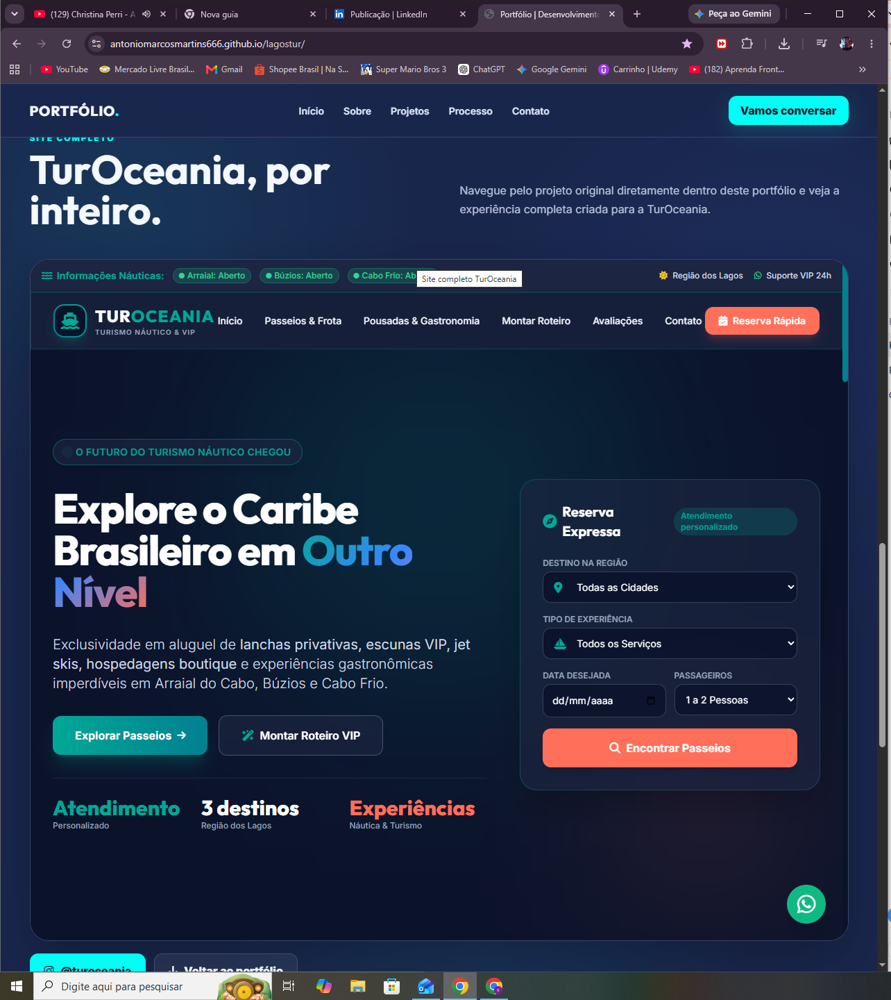

# 🌴 TurOceania


## ✈️ Site institucional para empresa de turismo

O **TurOceania** é um projeto de site institucional desenvolvido para uma empresa do segmento de turismo.

O projeto foi criado com foco em apresentar os serviços turísticos de forma moderna, organizada e responsiva, oferecendo aos visitantes uma experiência simples para conhecer a empresa e entrar em contato.

---

## 🌐 Acessar o projeto

👉 **[Abrir o site TurOceania](https://antoniomarcosmartins666.github.io/lagostur/)**

---

## 🖼️ Demonstração

### Tela principal

O site apresenta uma experiência visual voltada para o segmento de turismo, com informações sobre a empresa, serviços e formas de contato.




## ✨ Principais recursos

- 🌴 Apresentação da empresa
- ✈️ Informações sobre turismo
- 🗺️ Apresentação de destinos e serviços
- 📱 Interface responsiva
- 💻 Layout adaptado para diferentes dispositivos
- 📞 Área de contato
- 📸 Integração com redes sociais
- 🎨 Design visual voltado para o segmento turístico
- ⚡ Navegação simples e objetiva

---

## 🎯 Objetivo do projeto

O **TurOceania** foi desenvolvido para criar uma presença digital para uma empresa de turismo, permitindo apresentar seus serviços e informações de forma clara e profissional.

A proposta do projeto é proporcionar aos visitantes uma experiência agradável durante a navegação e facilitar o acesso às informações e canais de contato da empresa.

---

## 🏢 Projeto desenvolvido para empresa de turismo

O projeto foi desenvolvido como um trabalho real para uma empresa do segmento turístico.

A aplicação foi estruturada pensando nas necessidades de apresentação da empresa, comunicação com clientes e divulgação dos serviços oferecidos.

---

## 🛠️ Tecnologias utilizadas

- HTML5
- CSS3
- JavaScript
- GitHub Pages

---

## 📱 Responsividade

O projeto foi desenvolvido para oferecer uma experiência adequada em diferentes tamanhos de tela:

- 💻 Computadores
- 💻 Notebooks
- 📱 Smartphones
- 📱 Tablets

---

## 📸 Instagram

A **TurOceania** também possui presença no Instagram:

👉 **[Instagram oficial da TurOceania](https://www.instagram.com/turoceania/)**

---

## 🚀 Publicação

O projeto está publicado utilizando **GitHub Pages**.

🔗 **Projeto online:**

[https://antoniomarcosmartins666.github.io/lagostur/](https://antoniomarcosmartins666.github.io/lagostur/)

---

## 📂 Estrutura do projeto

```text
lagostur/
│
└── index.html
